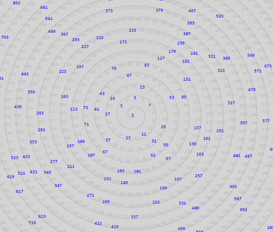
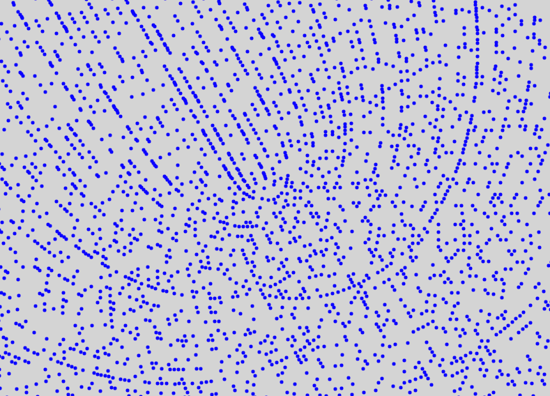

# Prime spiral

This demo is based on [this awesome Numberphile video](https://www.youtube.com/watch?v=iFuR97YcSLM) about Ulam spirals. My rendition uses Archimedean spirals instead, which are also covered by Numberphile in this [other video](https://www.youtube.com/watch?v=3K-12i0jclM).

